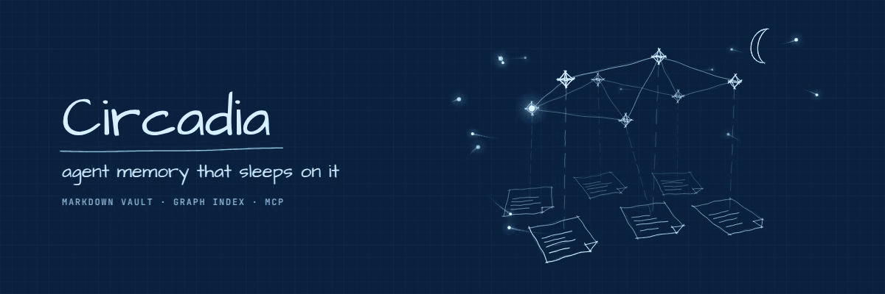

<p align="center">
  
</p>

<p align="center">
  <a href="https://www.npmjs.com/package/circadia"></a>
  
  
  
</p>

# Circadia

**Long-term memory for AI agents, kept as markdown notes you can read, with an index that
recalls the way people do.**

> [!WARNING]
> Circadia is under active development. Don't use it in production until v1.

## What is this?

A language model forgets everything when a conversation ends. An agent **memory system**
gives it somewhere to write things down and a way to find them again later, so it can pick
up where it left off, remember your preferences, and know that the service it helped you
move last month now runs somewhere else.

Most memory systems keep that memory in a database you can't easily read. Circadia keeps it
in a folder of plain markdown files (a **vault**) that you can open in any editor or in
[Obsidian](https://obsidian.md), fix by hand, and track in git. A small index sits next to
the vault and does the searching. You can delete the index at any time and rebuild it from
the notes.

The name comes from the *circadian rhythm*. Like a brain, Circadia writes down what happened
during the day, then **sleeps on it**: a nightly job turns the day's raw notes into
stable facts. Old facts are struck through and kept, never deleted, so the history stays
readable.

## Why Circadia

- **You can read your agent's memory.** Every memory is a markdown file. Nothing is hidden
  in an opaque store, and a human can always correct it.
- **Recall follows associations, not just keywords.** A question lights up a few matching
  notes, and that activation spreads along the links between notes, the way one memory
  reminds you of another (personalized PageRank, as in HippoRAG).
- **Facts know when they were true.** Each fact records when it was true in the world and
  when the vault believed it, so you can ask "where did this run in July?" and get July's
  answer (bi-temporal facts).
- **Agents can't write facts directly.** Agents write *episodes*, raw notes about what
  happened. Only the nightly consolidation can promote them to facts, and untrusted sources
  wait for a human. One poisoned web page can't become a trusted memory.
- **Every fact says where it came from.** Who stated it, which episode it came from, and how
  much to trust it. Low-trust memories are fenced off when they're handed to a model.
- **Small and local.** Zero runtime dependencies. It runs on Node's built-in SQLite, fits
  on a Raspberry Pi, and talks to agents over [MCP](https://modelcontextprotocol.io).
  Model calls (consolidation, optional extraction and embeddings) default to a local
  llama.cpp server.

## How it works

<p align="center">
  
</p>

The design copies one idea from neuroscience: the hippocampus doesn't store memories, it
stores a sparse **index of pointers** to content held elsewhere in the brain. In Circadia the
vault holds the content and the SQLite index holds only pointers, links and scores.

```
 ┌──────────────────── Agent (MCP client) ────────────────────┐
 │   remember → writes an episode          recall → reads index │
 └────────────┬───────────────────────────────────┬────────────┘
              ▼                                   ▼
 ┌── Vault (markdown, git, Obsidian) ──┐   ┌── Index (SQLite, derived) ──┐
 │  episodes/  append-only events      │──▶│  nodes: notes, passages     │
 │  entities/  notes + typed facts     │   │  edges: link, fact (bi-     │
 │  schemas/   consolidated summaries  │   │   temporal), provenance,    │
 │  procedures/ how-tos                │   │   triple (hipporag)         │
 └──────────────▲──────────────────────┘   │  FTS5 / BM25 keyword index  │
                │                          └─────────────────────────────┘
        Consolidation ("sleep"): nightly replay of episodes → facts, with
        schema-fit gating, bi-temporal invalidation, one git commit per run
```

## Get started

You need **Node.js 22.18 or newer**. Nothing else: SQLite is built into Node, and there are
no runtime dependencies to install.

There are two first-class ways to run Circadia. They run the same program; they differ in how
much of your machine the process can touch.

| | `npx` / global install | Docker from GHCR |
|---|---|---|
| setup | `npx circadia …`, or `npm install --global circadia` | pull `ghcr.io/therebelrobot/circadia` |
| runs | on the host, as you | in a container, as a non-root user |
| filesystem | the host's filesystem | read-only root; the vault is the only writable mount |
| network | the host's network | none by default |
| isolation | your user account only | the process can only write to the vault |

**`npx` / global install** is the simplest: it runs on the host with the host's filesystem and
network access. **Docker from GHCR** is the better-isolated option: the MCP server runs
non-root with a read-only root filesystem and no network by default, and the vault is the only
writable mount. It cannot install packages or reach the network unless you allow it.

### Try it in a minute (npx)

```bash
npx circadia init my-memory                # scaffold a vault: folders, config, templates
```

Write your first memory. Any markdown file with a little frontmatter works:

```bash
cat > my-memory/entities/projects/garden-sensors.md <<'EOF'
---
type: entity
kind: project
created: 2026-09-01
---
# Garden sensors

Soil-moisture sensors in the vegetable beds. Readings go over MQTT to a small
collector that decides when to water.

## Facts
- [runs_on:: [[raspberry-pi]]] [valid:: 2026-09-01..] [by:: user]
EOF
```

Index it and ask a question:

```bash
npx circadia index  --vault my-memory
npx circadia recall --vault my-memory "where does the garden collector run"
npx circadia recall --vault my-memory --context "garden sensors"   # formatted for an LLM
npx circadia timeline --vault my-memory garden-sensors             # every fact, in time order
```

> [!NOTE]
> `npx` and global installs need **circadia 0.3.2 or later**. Earlier releases only ran from
> a clone (see [ADR-0012](docs/decisions/ADR-0012-publish-time-js-build.md)).

### Install it

```bash
npm install --global circadia
circadia --help
```

### Run it in a container (Docker)

A multi-arch (amd64 and arm64) image runs the same stdio MCP server, published to GHCR. It is
the same program as the npm package, packaged differently; its value is isolation. The
container runs non-root with a read-only root filesystem and no network by default, and the
vault is the only writable mount, so the process can only write to the vault.

Run any command in it with the hardened invocation:

```bash
docker run --rm --read-only --tmpfs /tmp --cap-drop ALL \
  --security-opt no-new-privileges --network none \
  --user <uid>:<gid> -v <vault>:/vault \
  ghcr.io/therebelrobot/circadia:<version> index --vault /vault
```

Pin a version tag, or better an image digest. `--user <uid>:<gid>` must match the owner of the
vault on the host so the container can write episodes and the index; find it with `id -u` and
`id -g`.

**Network.** `--network none` is correct for the default configuration, which makes no network
calls. Drop it only when embeddings are enabled, and then attach the container to a network
that reaches only the embedding endpoint. Note that `127.0.0.1:8080` inside the container is
the container itself: point `embeddings.endpoint` at `http://<docker-host>:8080` or a service
name on that network.

**Nightly consolidation.** The image contains no scheduler. Run `consolidate` from a host cron
job or systemd timer with the same image:

```bash
docker run --rm --read-only --tmpfs /tmp --cap-drop ALL \
  --security-opt no-new-privileges --network none \
  --user <uid>:<gid> -v <vault>:/vault \
  ghcr.io/therebelrobot/circadia:<version> consolidate --vault /vault
```

**Verification.** The image is published with signed build provenance:

```bash
gh attestation verify oci://ghcr.io/therebelrobot/circadia:<version> --owner therebelrobot
```

The GHCR package starts private and must be made public once, in its package settings.

### Connect it to your agent (MCP)

`circadia mcp` is an MCP server over stdio. It exposes `recall`, `remember`, `timeline`,
`relate`, `get_note`, and the dream tools (`wake`, `endorse_dream`, `dismiss_dream`). Add it
to any MCP client's server list. Pick either transport.

On the host with `npx`:

```json
{
  "mcpServers": {
    "circadia": {
      "command": "npx",
      "args": ["-y", "circadia", "mcp", "--vault", "/path/to/my-memory"]
    }
  }
}
```

With a global install, use `"command": "circadia"` and drop `-y` and `circadia` from `args`.

In the sandboxed container (the flags are explained under
[Run it in a container](#run-it-in-a-container-docker)):

```json
{
  "mcpServers": {
    "circadia": {
      "command": "docker",
      "args": [
        "run", "-i", "--rm", "--read-only", "--tmpfs", "/tmp", "--cap-drop", "ALL",
        "--security-opt", "no-new-privileges", "--network", "none",
        "--user", "<uid>:<gid>", "-v", "<vault>:/vault",
        "ghcr.io/therebelrobot/circadia:<version>"
      ]
    }
  }
}
```

The server speaks only stdio, so it has no network port to secure. Agents can write episodes
but never facts ([`docs/SECURITY.md`](docs/SECURITY.md)). For a TypeScript agent, see the
[Mastra example](examples/mastra/).

### Build from source

```bash
git clone https://github.com/therebelrobot/circadia.git
cd circadia
npm install                  # dev tools only: typescript, @types/node, the MCP SDK for tests
npm test                     # the full suite
npm run typecheck

npm run example:index        # index the bundled example vault
npm run example:recall -- "where does the orchard collector run"
node bin/circadia.mjs --help # the CLI runs straight from source, no build step
```

From a clone, TypeScript runs directly with Node's type stripping. The only build is the
one `npm pack` runs for publishing (`npm run build` emits plain JS to `dist/`). To use your
checkout as the global `circadia` command, run `npm link`.

### Open it in Obsidian

Open the vault folder as an Obsidian vault and set the templates folder to
`_meta/templates`. Install the Dataview plugin to query facts inside Obsidian:

```dataview
TABLE runs_on, valid FROM "entities" WHERE runs_on
```

## A tour

### Recall: cue, spread, rank

<p align="center">
  
</p>

1. **Cue.** Keyword search (SQLite FTS5, or a built-in BM25) and entity names in the
   question pick a few starting notes, the **seeds**. Optional embeddings add a third list.
2. **Spread.** Activation flows out from the seeds along links and facts (personalized
   PageRank). Related notes light up even when they share no words with the question.
3. **Rank.** Scores combine graph activation, how recently and often a note was used
   (ACT-R activation, so unused memories fade without being deleted), and note importance.
4. **Budget.** The best passages are packed into a token budget and handed to the model.
   Every hit shows its score breakdown, so rankings are explainable.

Details: [`docs/RETRIEVAL.md`](docs/RETRIEVAL.md).

### Time: facts have two clocks

<p align="center">
  
</p>

```md
## Facts
- [runs_on:: [[pi-cluster]]] [valid:: 2026-08-11..] [by:: user] [src:: [[2026-08-11-migration]]] ^f-orch-host

## History
- ~~[runs_on:: [[old-laptop]]] [valid:: 2026-06-01..2026-08-11]~~ [superseded:: 2026-08-11] [by:: user]
```

The subject is the note the fact lives in. `valid` is **world time**: when the fact was true.
`at` and `superseded` are **system time**: when the vault believed it. `--as-of` answers as
the vault stood and as the world was at that moment:

```bash
circadia recall --vault my-memory --as-of 2026-07 "where did it run"
```

Full grammar: [`docs/SCHEMA.md` §4](docs/SCHEMA.md).

### Sleep: from episodes to facts

<p align="center">
  
</p>

Agents call `remember`, which writes an **episode**: an append-only note about what
happened. `circadia consolidate` (run it nightly from cron or a systemd timer) replays new
episodes, extracts candidate facts with a small model (set `extraction.provider` first;
it is off by default), and runs each through a **schema-fit gate**:

- a fact about a known entity, with a known predicate, that contradicts nothing is promoted;
- anything novel, contradictory, or from an untrusted source (`web`, `tool`) waits in a queue
  for you, in `circadia review`.

Promoted facts cite their episode (`src::`), and the whole run is one git commit you can
read or revert.

### Graph modes: pay for structure only when you need it

<p align="center">
  
</p>

| mode | uses | cost | when |
|---|---|---|---|
| `wikilink` | links you wrote | none | default first rung; most everyday recall |
| `typed` | + typed, time-stamped facts + provenance | none | as-of queries, relationships, multi-entity cues |
| `hipporag` | + LLM-extracted phrase graph (triples) | LLM + cache | deep or research topics, scoped by tag or path |

You choose how much structure to **build** per note (frontmatter `graph:`, then the first
matching `graph.scopes` rule, then `graph.defaultExtraction`). Each query then chooses how
much to **use**. In the default `auto` mode it climbs `wikilink → typed → hipporag` only
when the result looks weak: too few seeds, no clear winner, several entities named, or a
time-travel query.

### Dreaming: loose associations, never facts

<p align="center">
  
</p>

Real sleep has a second phase. REM sleep recombines distant memories, which may be why
sleep helps with creative leaps. `circadia dream` pairs recently active notes with distant,
older ones and asks the model whether anything connects them. The answer is a **candidate
association**, stored outside the vault, read once with `circadia wake`, and given zero
weight in recall until the eval shows it helps. Only you can turn one into a fact, in
`circadia review`. See [RFC-0001](docs/rfcs/RFC-0001-dreaming.md).

## Inspired by the brain

Each mechanism maps to a finding from cognitive science. The reasoning is in
[`docs/ARCHITECTURE.md`](docs/ARCHITECTURE.md), and every source is in
[`docs/SOURCES.md`](docs/SOURCES.md).

| Brain | Circadia |
|---|---|
| Hippocampal indexing: the hippocampus stores *pointers* to cortical content | The vault holds content; the SQLite index holds only pointers, edges, and scores, and can be rebuilt from the vault |
| Complementary learning systems: fast episodic store, slow semantic consolidation | Episodes are written immediately; facts only come from consolidation |
| Spreading activation (Collins & Loftus) | Personalized PageRank from cue-matched seeds (as in HippoRAG) |
| ACT-R base-level activation: recency × frequency, power-law decay | Access log → activation term in ranking; forgetting demotes, never deletes |
| Reconsolidation: recall makes a memory labile | Every recall is logged; contradicted recalls get flagged for revision |
| Source monitoring: false memories are mostly source errors | Every fact records `by::`, `src::`, `trust::`; low-trust recall is fenced as data |
| Event segmentation | Episodes are cut at topic shifts, not token counts |
| Schemas accelerate consolidation | Schema-fit gate: facts that fit known entities merge fast; novel ones need corroboration |
| Sleep has two phases: NREM replay consolidates, REM recombines across schemas | A REM pass pairs recently active notes with distant ones; output is a candidate association, never a fact |

## Status

Phases 1–8 of the [roadmap](docs/ROADMAP.md) are implemented and tested:

| phase | what it added |
|---|---|
| 1 | Vault schema v1, parser, linter, indexer, configurable graph modes, recall pipeline, untrusted-content fencing, example vault |
| 2 | Incremental indexing, `watch`, embeddings, `relate` and `timeline`, graph cache, benchmarks |
| 3 | MCP server, event segmentation for transcripts, Mastra example |
| 4 | Consolidation ("sleep") with the schema-fit gate, bi-temporal supersession, one commit per run, `review` |
| 5 | HippoRAG triple extraction, synonym edges, recognition-memory seed filter, triple promotion |
| 6 | Git-backed `--as-of` for prose, `history`, access-log compaction |
| 7 | `circadia eval`: recall@k and MRR per mode and query kind, tuning, ablations, LongMemEval and LoCoMo adapters |
| 8 | Dreaming: REM pass, read-once `wake`, human confirmation, weight-0 dream edges |

Retrieval numbers and their limits are in [`docs/EVAL.md`](docs/EVAL.md) and
[`docs/PERFORMANCE.md`](docs/PERFORMANCE.md).

## Command reference

```bash
circadia init <dir>                          # scaffold a vault
circadia lint     --vault <dir>              # check against the schema
circadia index    --vault <dir> [--full]     # incremental index (or full rebuild)
circadia watch    --vault <dir>              # reindex on change
circadia recall   --vault <dir> "<query>"    # --as-of, --mode, --scope, --context, --json
circadia relate   --vault <dir> <a> <b>      # shortest paths between two notes
circadia timeline --vault <dir> <entity>     # fact history
circadia history  --vault <dir> <id>         # a note across git commits
circadia consolidate --vault <dir>           # nightly "sleep" (--dry-run, --dream)
circadia review   --vault <dir>              # accept or reject queued candidates
circadia dream    --vault <dir>              # REM pass (--sample-only makes no model calls)
circadia wake     --vault <dir>              # read the night's dream log once
circadia extract  --vault <dir>              # hipporag triple extraction
circadia mcp      --vault <dir>              # MCP server over stdio
circadia stats    --vault <dir>
circadia eval                                # retrieval eval (see docs/EVAL.md)
circadia --help                              # every option
```

Model-backed commands (`consolidate`, `extract`, `dream`) call an OpenAI-compatible HTTP
endpoint, `http://127.0.0.1:8080` (llama.cpp's `llama-server`) by default. For hosted
models, point it at OpenRouter with a spend-capped key. See
[`docs/CONFIG.md`](docs/CONFIG.md).

## Repository map

```
bin/circadia.mjs         launcher (source via type stripping in a clone; dist/ when installed)
src/
  types.ts                 shared types
  config.ts                config defaults, loading, validation
  vault/                   frontmatter subset, time, wikilinks, fact grammar, note parser, walker
  index/                   SQLite schema + full-rebuild and incremental indexer
  extract/                 extraction-scope selection, hipporag triples
  retrieval/               keyword (FTS5/BM25), PPR, ACT-R, mode ladder, recall, context rendering
  cli/                     CLI
  mcp/                     MCP server (stdio)
  consolidation/           episode replay → gate → promote, queue, or supersede
  dreams/                  REM pass, wake recall, dream edges
  eval/                    retrieval eval, metrics, ablations, adapters
templates/                 Obsidian note templates (copied into vaults by `init`)
examples/vault/            fictional vault exercising every feature
examples/mastra/           Mastra agent using Circadia over MCP
test/                      node:test suites
docs/                      SCHEMA, ARCHITECTURE, RETRIEVAL, CONFIG, SECURITY, EVAL, ROADMAP, SOURCES,
                           decisions/, rfcs/, media/
AGENTS.md                  start here if you are an agent picking this up
```

## Documentation

- [`docs/SCHEMA.md`](docs/SCHEMA.md): the vault format, which is the contract.
- [`docs/ARCHITECTURE.md`](docs/ARCHITECTURE.md): the cognitive principles and each design
  decision they drive.
- [`docs/RETRIEVAL.md`](docs/RETRIEVAL.md): modes, scopes, the escalation ladder, scoring,
  and as-of semantics.
- [`docs/CONFIG.md`](docs/CONFIG.md): every config key.
- [`docs/SECURITY.md`](docs/SECURITY.md): threat model and defaults.
- [`docs/EVAL.md`](docs/EVAL.md) and [`docs/PERFORMANCE.md`](docs/PERFORMANCE.md): how
  retrieval is measured, and what the numbers mean.
- [`docs/ROADMAP.md`](docs/ROADMAP.md): phases with acceptance criteria.
- [`docs/SOURCES.md`](docs/SOURCES.md): every paper, doc, and issue this design draws on.
- [`docs/decisions/`](docs/decisions/) and [`docs/rfcs/`](docs/rfcs/): architecture
  decisions and design proposals.
- [`AGENTS.md`](AGENTS.md): conventions and invariants for contributors, human or agent.
  **Read it before changing code.**

## License

Public domain, under [The Unlicense](LICENSE).
