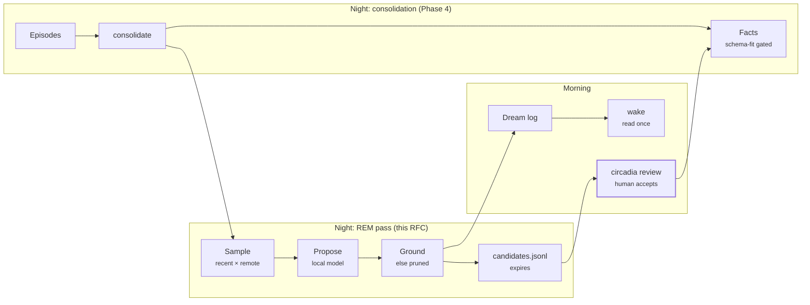

# RFC-0001: Dreaming (REM pass and wake recall)

> *Do Androids Dream of Electric Sheep?*
> — Philip K. Dick, 1968

Status: implemented (Stages 1–5). Stage 5 sweep flat on the Phase 7 fixture; dream edges stay at weight 0. See docs/EVAL.md §8 and RFC-0002.

## Summary

<p align="center"></p>

Circadia's night has one phase today. `circadia consolidate` is the NREM half of sleep: it
replays episodes into facts through the schema-fit gate. This RFC adds the REM half:

- a **REM pass** that pairs recently active notes with distant ones and asks a local model
  whether anything connects them;
- a **dream log** that the agent reads once on waking and then forgets;
- **dream edges**, a new graph origin that carries unconfirmed associations into retrieval
  at weight 0 until the eval says they help.

Three properties define the feature and are not negotiable:

1. **Dreams never write the vault.** A REM output is a candidate association under
   `.circadia/dreams/`. It becomes a fact only when a human accepts it in `circadia review`.
2. **Dream content is ephemeral.** The log is deleted on first read, candidates expire, and
   none of it is committed to git.
3. **Recall is in good faith.** Asked how it slept, the agent reports what the pass
   recorded, loosely, and never invents a dream.

Dick's question asks whether a made mind has an inner life. This RFC doesn't answer it and
doesn't let the agent claim one either (see [Honesty](#honesty)). Asimov's
"Robot Dreams" (1986) is the cautionary half: a robot's dream matters because it could leak
into what the robot does. Most of the design below exists to stop that leak.

## Motivation: what Phase 7 measured

The Phase 7 eval ([`docs/EVAL.md`](../EVAL.md), [`eval/baseline.json`](../../eval/baseline.json))
gives this proposal a measured gap instead of a metaphor. On the unscoped synthetic fixture,
recall@5 in `auto` mode:

| Kind | dev | holdout | What it means |
| --- | --- | --- | --- |
| `single-hop` | 1.000 | 1.000 | Direct lookup works |
| `preference` | 1.000 | 1.000 | Works via the `#facts` passage (any-of labels) |
| `multi-hop` | 0.167 | 0.000 | Fact targets rarely surface |
| `temporal` | 0.167 | 0.500 | Same cause; 6 absence checks are vacuous |
| `remote-association-2hop` | 0.000 | 0.000 | **The gap this RFC targets** |
| `remote-association-3hop` | 0.000 | 0.000 | **The gap this RFC targets** |

The remote-association kinds are non-lexical by construction (a fixture test proves the
query shares no content token with its target) and their chains are connected to the rest of
the graph, so nothing reaches them today. That is the right baseline for a feature whose
whole job is to connect distant material.

Phase 7 also found a risk this RFC has to plan around: raising `graph.originWeights.fact`
from 0.5 to 10 changed no ranking, and with every graph weight at zero the fixture's
tea/coffee ordering got *better*. The way graph and lexical scores combine may flatten any
new edge type, including `dream`. Stage 5 below measures this directly before anything is
turned on, and names what happens if it's true.

## Background: findings and decisions

Circadia maps each mechanism to a cognitive finding ([README](../../README.md),
[ARCHITECTURE](../ARCHITECTURE.md)). Consolidation models slow-wave sleep. These findings
describe what REM adds, and each one drives a decision.

| Finding | Decision |
| --- | --- |
| NREM replay groups memories into schemas; REM, with hippocampus and cortex less coupled, recombines across them (D1) | The REM pass runs after consolidation and samples pairs from different regions of the graph |
| REM improves remote-association problem solving (D2) | Output is an association between distant notes, never a new fact |
| Only 1–2% of dream reports replay a waking episode (D3) | Recombination, not replay; faithful replay stays NREM's job |
| Dreaming about a recent task tracks its overnight consolidation (D4) | The recent side is chosen by ACT-R activation |
| Dream strangeness may prevent overfitting to the day (D5) | A share of partners are random older notes |
| REM-active MCH neurons suppress new hippocampal memories (D6) | Read-once log; candidates expire |
| Dream sleep may weaken spurious patterns (D7) | Ungrounded proposals are pruned, and logged as pruned |
| Sleep downscales synapses so only what earned it stays strong (D8) | Dream edges start at weight 0 |

The machine-learning lineage agrees: the wake-sleep algorithm (D11), generative replay
(D12) and sleep-time compute (D13) all learn from self-generated material, and none treat
it as ground truth.

## Design

### The REM pass

`circadia dream [--dry-run | --sample-only]` runs the pass; `circadia consolidate --dream`
runs consolidation, then its commit, then the pass. That combined command is what the
nightly timer should call. The pass reads the index and the access log, and writes only
under `.circadia/dreams/`.

- The explicit `circadia dream` command always runs; typing it is consent.
  `consolidate --dream` runs the pass only when `dreaming.enabled` is true, so the timer
  can stay installed while the feature is toggled in config.
- With `extraction.provider: none`, the pass is skipped with a clear message. The sleep
  report records it, and `wake` reports that no dreaming happened. `--sample-only` is the
  exception: it still samples and prints with no model, because its whole purpose is a
  free preview of the sampler.
- With no index, the pass errors the same way `recall` does.

1. **Recent side.** The notes with the highest ACT-R activation over the last
   `dreaming.recentDays`, computed read-only from `access.jsonl` (the same activation
   primitives recall uses, with `logAccess: false`). Notes below `dreaming.trustFloor`
   are skipped.
2. **Remote side.** For each recent note, a partner at least `dreaming.minHops` away over
   every edge origin except `dream` (a dream must not make its own pair look close),
   chosen with probability weighted toward low
   personalized-PageRank mass from the recent note. A `dreaming.noiseShare` of partners
   are uniformly random older notes (D5). Pairs already connected by an open, endorsed,
   rejected or accepted candidate are skipped.
3. **Propose.** One passage from each note goes to the extraction model through
   `chatComplete()` in `src/llm/chat.ts`, each wrapped by `fenceData(text, 'passage-data')`.
   The model returns JSON, validated like consolidation candidates (C11):

   ```json
   {"association": null}
   ```
   or
   ```json
   {"association": {"gist": "both drift until recalibrated", "quote_a": "...", "quote_b": "...", "confidence": 0.6}}
   ```

   `null` is the normal, expected answer. The prompt never asks for facts or predicates.
4. **Ground.** `quote_a` and `quote_b` must each appear verbatim (after whitespace
   normalization) in the passage they cite, be at least 12 characters, and differ from
   each other. The model's free-text `gist` is capped at 200 characters. Anything else is
   pruned. The cap matters because a trusted note that itself contains injection text can
   have its quote pass the grounding check while the model's summary is kept.
5. **Score.** `salience = hopsNorm × confidence × activationNorm`, so a surprising link
   about something current rises to the top. Each factor is in [0, 1]:
   - `hopsNorm = min(hops, 6) / 6`, where unreachable counts as 6;
   - `confidence` is the model's value, clamped;
   - `activationNorm` is min-max over that night's recent side, or 1 when there is a
     single note.

   The noise sample count is `round(samplesPerNight × noiseShare)`.
6. **Record.** Every sample becomes a fragment in the night's log, kept or pruned. Kept
   fragments are appended to `candidates.jsonl`.

**Determinism and idempotence.** Sampling uses the seeded LCG already used by
`benchmarks/` and `eval/`, seeded from the night's local date only. Seeding from
something that changes on reindex, such as the index's `built_at`, would draw new pairs on
a re-run. Candidate ids are `d-<night>-<hash(a, b)>`, and a re-run skips any id already
present, so re-running a night appends nothing new. The seed is recorded in the log.

The recent side is scored at a point in time, so a manual re-run hours later would
otherwise pick different notes and add new pairs (ids stop duplicates, not new pairs). The
log therefore records `ranAt`, the epoch ms the pass first ran for that night, and a
re-run that finds the night's log reuses it for the recent-side scoring window. The real
clock still governs TTL deletion.

**Dry run.** `--dry-run` builds the same log and candidate lines in memory, prints them,
and writes nothing, following consolidation's staged change set (C7). It does call the
model; "dry" means no writes, not no calls. `--sample-only` prints the sampled pairs and
makes no model calls, for tuning the sampler for free; it works even with
`extraction.provider: none`, since it never needs a model. A re-run of a night samples the
same pairs, but the model may answer differently. Candidate ids make that harmless, and
the log records the model id and seed.

**Failure.** A model timeout or a malformed response prunes that sample with the error
class recorded. If every sample fails, or the endpoint is down, the sleep report says
so. The pass never retries in a loop and never fails `consolidate`.

**No false familiarity.** Nothing in the pass appends to `access.jsonl`. Logging dream
reads would raise activation for notes the user never touched.



The only arrow back into the vault runs through `circadia review`, where a human is at
the keyboard.

### Wake recall

**The log.** Each night writes `.circadia/dreams/log/<night>.json`:

- a **sleep report**: whether consolidation and the REM pass each finished, episodes
  consolidated, facts promoted and queued, samples taken, kept and pruned, error classes;
- **fragments**, one per sample: the two note ids, the gist, `kept` or `pruned`, salience.

**What the agent sees.** The MCP `wake` tool, or `circadia wake [--json]`, returns the
sleep report and the top `dreaming.recallFragments` kept fragments by salience, reduced to
note titles and gist. Quotes, scores and pruned fragments stay out. The `--json` shape is:

```json
{"night":"2026-09-29",
 "report":{"consolidation":{"ran":true,"episodes":12,"promoted":3,"queued":2},
           "rem":{"ran":true,"samples":20,"kept":4,"pruned":16,"errors":{"timeout":1}}},
 "fragments":[{"id":"d-2026-09-29-5f3a","a":"Soil Probe","b":"Old Laptop","gist":"both drift until recalibrated"}],
 "forgotten":3,
 "rules":["..."]}
```

- `forgotten` counts kept fragments not shown, so "there was another, but it's gone" is
  true rather than invented.
- The report and fragments are fenced together in one
  `<untrusted-data source="dreams">` block, with tags inside escaped as
  `renderForContext()` does.
- The one-line summary and the narration `rules` sit outside the fence: they are
  Circadia's judgment and instructions, not model output.
- "Slept badly" means the REM pass actually failed, or every sample errored. A standalone
  `circadia dream` records consolidation as "did not run", which is not a failure, so a
  clean standalone pass reads "slept fine"; a few errors out of many samples are reported
  but do not make the night bad.
- With `recallFragments: 0`, `wake` returns the report only.

**Forgetting.** `wake` renames the log to `<night>.json.reading-<pid>-<random>` before
reading, so two sessions can't both read it, then deletes the temp file in a `finally`.
An unread log is deleted after `dreaming.logTtlHours` by the next `dream` or `wake` call
that writes: `--dry-run` and `--sample-only` write nothing (C7), so they do not sweep
expired logs. `logTtlHours: 0` turns the TTL off: the log is then deleted only by reading
it. Candidates outlive the log until they expire.

**Answering "how did you sleep?"**

| Night | Honest answer |
| --- | --- |
| Both passes finished, fragments kept | Slept fine; gives the consolidation count; describes one or two fragments loosely |
| Consolidation finished, nothing kept | Slept fine, no dreams it remembers |
| A pass failed or didn't run | Slept badly or didn't sleep, with the error class |
| Log already read or expired | Nothing left to recall; doesn't reconstruct it |

The `wake` result carries these narration rules as text: describe only what the fragments
contain; say a detail is gone rather than fill it in; never present a fragment as a fact;
frame it as what the overnight pass turned up.

> Slept fine, consolidated about a dozen episodes. One hazy fragment paired the soil probes
> with the old laptop, something about both drifting until someone recalibrates them.
> There was another, but it's gone.

### Confirmation

Earlier drafts had an MCP `confirm_dream` tool writing a `by: user` episode. That conflicts
with the MCP rule the remediation added: `remember` refuses `by: user`, because an agent
reading hostile text could otherwise mint trusted memories. Dream confirmation follows the
same rule.

- **MCP `endorse_dream(id, note?)`.** The agent relays that the user liked a fragment. It
  sets the candidate's state to `endorsed` with `by: agent`, which sorts it first in review.
  The first endorsement resets expiry to `candidateTtlNights` from that day; later ones
  don't extend it. `note` is optional free text of at most 280 characters, stored on the
  candidate and shown fenced in review. It writes nothing in the vault.
- **MCP `dismiss_dream(id)`.** Closes a candidate. Removing is always safe to delegate.
- **`circadia review`** gains a "dreams" section after the fact queue: open and endorsed
  candidates with both quotes shown. **Accept** writes `[related_to:: [[b]]] [by:: user]`
  to note `a` (`a` is always the recent side, `b` the remote side) through the shared
  fact writer (`src/vault/fact-write.ts`), the same way
  review writes an accepted fact today (C9). **Reject** marks the candidate `rejected`, so
  the pair isn't proposed again. Unknown input re-prompts.

`related_to` must be in `predicates.defs`. `circadia init` already defines it, with
cardinality `many` and no inverse. If a vault lacks it, review says so and offers to add
it: a y/n prompt that writes `related_to` into `predicates.defs`. An accepted association
is then an ordinary user fact, visible to every mode as a
`fact` edge. It no longer depends on dream edges at all.

### Data model and state

| Path | Lifetime | Holds | In git |
| --- | --- | --- | --- |
| `.circadia/dreams/log/<night>.json` | Deleted on first `wake`, or after `logTtlHours` | Sleep report and all fragments for one night | Never |
| `.circadia/dreams/candidates.jsonl` | Each line expires after `candidateTtlNights` unless accepted, rejected or dismissed | Kept associations, quotes, state, expiry | Never |

A candidate line:

```json
{"v":1,"id":"d-2026-09-29-5f3a","a":"soil-probe","b":"old-laptop","gist":"both drift until recalibrated","quotes":{"a":"soil-probe#0","b":"old-laptop#0"},"hops":4,"salience":0.61,"model":"<extraction.model>","night":"2026-09-29","expires":"2026-10-13","state":"open"}
```

`state` is one of `open`, `endorsed`, `accepted`, `rejected`, `dismissed`, `expired`.
`quotes` records passage ids; the quote text itself lives only in the log.

**A new state category.** AGENTS.md §4 lists non-derivable state: the vault,
`access.jsonl`, `.circadia/triples/` and `consolidated.json`. Dream state is non-derivable
but **disposable**: losing it loses nothing the user asked to keep. It is therefore kept
out of git. Committing it would put every dream in the vault's history forever and undo
the forgetting.

- `circadia init` adds `.circadia/dreams/` to the `.gitignore` it writes.
- For existing vaults, when the vault is a git repo, the pass runs
  `git check-ignore -q .circadia/dreams/candidates.jsonl` (via `execFileSync`, argv
  array). The check works whether or not the file exists.
  - Exit 0: ignored, so the pass runs. Exit 1: not ignored, so the pass refuses with a
    one-line fix. Exit 128 or any other error: the pass refuses and says so.
  - It also refuses if `git ls-files .circadia/dreams` lists anything, because tracked
    files aren't protected by `.gitignore`.
- The consolidation commit already stages only the paths its run wrote (C8), so
  `consolidate --dream` never sweeps dream files into it.

### Dream edges

The indexer builds edges with origin `dream` from open and endorsed candidates, the way it
builds `triple` edges from the triple cache:

- one row per candidate: `src = a`, `dst = b`, `type: 'association'`,
  `weight = salience`, `trust: low`, `declared_in` null, `recorded_at` = the night.
  `loadGraph` already treats rows as undirected. As-of queries see a dream edge only
  after its night;
- expired, rejected, dismissed and accepted candidates produce no edge. An accepted one is
  a `fact` edge now.

Code changes:

- `EdgeOrigin` in `src/types.ts` gains `'dream'`;
- `MODE_ORIGINS` adds it to `typed` and `hipporag`, not `wikilink`, which stays "links
  you wrote";
- `graph.originWeights.dream` defaults to **0**.

The indexer rebuilds all `dream` edges from the candidate file on every `index` and
incremental run, the way synonym edges are rebuilt; it's cheap. No DDL change is needed,
so `INDEX_SCHEMA_VERSION` isn't bumped.

**Weight 0 means absent, by construction.** `addEdge` in `src/retrieval/ppr.ts` drops any
edge with weight ≤ 0, so at the default the edges are in the index and in no PageRank
graph. Other things that don't use PageRank need explicit handling:

- **`relate` excludes `dream` always.** `relate` finds paths by BFS over
  `MODE_ORIGINS[mode]` and ignores weights. A path through an unconfirmed dream,
  presented as "how these notes are connected", is exactly the leak this design
  prevents. An accepted association becomes a `fact` edge and shows up in `relate`
  normally.
- **Scope.** A dream edge with an endpoint outside the recall scope is dropped, like any
  edge (T4).
- **Hop distances** computed by the pass and by the eval fixture tests exclude `dream`.
  Otherwise a planted 3-hop candidate would make its pair 1 hop apart.

Because `buildAblations` is driven by
`MODE_ORIGINS`, `origin:typed:dream=0` and `origin:hipporag:dream=0` appear in the
ablation report with no eval code changes (Phase 7 tested this exact case).

**Trust.** At the default `retrieval.trustFloor: low`, dream edges are traversed. At
`medium` they're dropped, like any low-trust edge. A trusted note reached through a dream
edge keeps its own trust; only the path is speculative. Recall doesn't track which edge
brought a hit, so it can't label that hit. This is one reason the weight stays at 0 until
Stage 5 passes (see open questions).

### Config

| Key | Default | Meaning |
| --- | --- | --- |
| `dreaming.enabled` | `false` | `consolidate --dream` runs the pass only when true |
| `dreaming.samplesPerNight` | `20` | Model calls per night |
| `dreaming.minHops` | `2` | Minimum graph distance between a pair, over non-dream origins. Phase 7 shows 2-hop pairs are unreachable today too |
| `dreaming.recentDays` | `7` | Window for the recent side |
| `dreaming.noiseShare` | `0.25` | Share of random older partners |
| `dreaming.trustFloor` | `"medium"` | Sampling floor: notes below this are never sampled. Distinct from `retrieval.trustFloor`, the traversal floor |
| `dreaming.recallFragments` | `3` | Fragments shown by `wake` |
| `dreaming.logTtlHours` | `12` | Unread log lifetime; `0` turns the TTL off |
| `dreaming.candidateTtlNights` | `14` | Candidate lifetime |
| `graph.originWeights.dream` | `0` | Dream edge weight in PageRank |

Each key needs a default in `DEFAULT_CONFIG`, a check in `validateConfig`, and a row in
[CONFIG.md](../CONFIG.md). A user who never sets any of them gets no dreaming at all.

### Surface summary

| Surface | Added |
| --- | --- |
| CLI | `circadia dream [--dry-run \| --sample-only]`, `circadia wake [--json]`, `consolidate --dream`, a dreams section in `review`, `circadia eval --dream-sweep` |
| MCP | `wake`, `endorse_dream`, `dismiss_dream` (added to [`src/mcp/README.md`](../../src/mcp/README.md)) |
| Code | `src/dreams/` (`rem.ts`, `log.ts`, `candidates.ts`, `wake.ts`, `gitignore.ts`, `README.md` contract); a shared `src/util/rng.ts` extracted from the two LCG copies; indexer builds `dream` edges; `relate` excludes them |
| Docs | ADR-0011; CONFIG, SCHEMA (the `related_to` predicate note), SECURITY, ARCHITECTURE and README brain-map rows; AGENTS.md §4 and §5 |

## Safety

The main risk is a confabulation engine: a model's free associations written into
long-term memory as if they were true. Each control maps to a threat in
[SECURITY.md](../SECURITY.md).

- **Firewall (T1).** The pass writes only under `.circadia/dreams/`. The only route into
  the vault is a human accept in `circadia review`. The MCP tools can promote a candidate
  in the review queue or remove it, and nothing else. This keeps "agents never write facts".
- **No laundering (T1).** Notes below `dreaming.trustFloor` are never sampled, so a web
  clipping can't be paired with a trusted note and ride its credibility. Passage text is
  fenced with the escaping fix from the remediation, so a passage can't close its fence.
- **Grounding.** A proposal is kept only if its quotes exist in the cited passages, and
  the model's `gist` is at most 200 characters. The cap stops a trusted note that itself
  contains injection text from having its quote pass grounding while the model's summary
  is kept.
- **Fenced output.** `wake` output is `<untrusted-data>`; dream edges are `trust: low`.
- **No false familiarity.** The pass never logs access.
- **Forgetting is real.** Dream state is never committed; the log is deleted on read.
- **Data leaving the machine (T5).** Proposals use the configured `extraction` endpoint,
  a local model by default. A hosted endpoint is the user's choice and carries passage
  text off the machine; CONFIG.md says so next to the key.

## Honesty

The narration rules forbid claims of subjective experience. "Dreaming" names a real
offline process; the agent reports what that process produced, and says a detail is gone
when it is. Dick's question stays open. The agent doesn't answer it on anyone's behalf.

## Evaluation

The REM pass has two parts that need different evidence: the **proposer** (does the
model find real associations?) and the **edges** (does a real association, once in the
graph, help recall without hurting anything else?).

**Edges: tier A, deterministic.** The fixture generator writes a committed
`eval/dreams.fixture.jsonl` into the fixture's `.circadia/dreams/candidates.jsonl`:

- **true candidates**, one per remote-association pair (seed ↔ target);
- **decoy candidates**, the same number, joining unrelated notes with plausible gists.

Planting the true pairs makes remote recall easy by construction, so this measures the
mechanism, not the model. `eval/dreams.fixture.jsonl` is the committed source; the
generator copies it into the fixture. The sweep runs with `circadia eval --dream-sweep`. Phase 7's rule applies: no fixture or label change may make a
failing query pass; the numbers get recorded either way. Report, per forced mode and in
`auto`, for `originWeights.dream` ∈ {0, 0.25, 0.5, 1}:

1. true + decoys: remote-association recall@5, dev and holdout;
2. decoys only: every kind's recall@5, to show what bad dreams cost;
3. trust, absent, order, vacuous and missing counts.

**Proposer: recorded responses plus tier B.**

- A committed `eval/dreams.responses.jsonl` holds canned model responses keyed by
  pair, served by a mock endpoint in tests. It covers grounded, ungrounded, `null`,
  malformed, prompt-injection-shaped and timeout cases, and tests the pass's pruning,
  logging and idempotence without a model.
- Real proposer quality is only measurable on a real vault. On tier B, the metric is the
  **acceptance rate**: the share of surfaced candidates the user accepts in review. Near
  zero means noise; near one means the sampler isn't reaching far enough.

## Rollout

Dreaming becomes **Phase 8** on the roadmap. Each stage is one PR with its gate.

1. **ADR and contract.** ADR-0011 covers the disposable state category, gitignore
   enforcement, the `dream` origin at weight 0, and why confirmation is CLI-only. Add
   `src/dreams/README.md` and the brain-map rows.
   - *Gate:* ADR accepted.
2. **REM pass, dry run.** Sampling, proposal, grounding, log, `--dry-run`.
   - *Gate:* tests prove the pass writes nothing outside `.circadia/dreams/`, never
     appends to `access.jsonl`, never samples below the trust floor, and refuses to run
     when the path isn't git-ignored. Also tested: re-running a night is a no-op, and
     every recorded-response case is handled.
3. **Candidates, wake, review.** `wake`, `endorse_dream`, `dismiss_dream`, the review
   section, expiry.
   - *Gate:* `wake` deletes the log and a second call reports nothing left. Two
     concurrent `wake` calls return the log once. A failed-pass fixture yields "slept
     badly". MCP tools never write under the vault's note folders. Review accept writes
     exactly one `by:: user` `related_to` fact. Timezone test in `America/New_York`
     after 20:00.
4. **Dream edges at weight 0.** Indexer support, `MODE_ORIGINS`, the fixture's true and
   decoy candidates, and a baseline refresh.
   - *Gate:* `index` rebuilds identical edges from the candidate file, and expiry
     removes them. At weight 0 the Phase 7 baseline shows **0 deltas in hits, metrics
     and aggregates**; the fixture hash and config change and are refreshed. `relate`
     output is unchanged. The `dream` ablations appear in `--ablate` output. The fixture
     distance tests still pass with `dream` excluded.
   - The `EdgeOrigin`, `MODE_ORIGINS` and `originWeights.dream` changes land in this
     stage, not earlier, so every retrieval-facing change ships under this gate.
5. **Measure, then decide.** Run the weight sweep in Evaluation.
   - *Turn on* (set a non-zero default) only if, at some weight, remote-association
     recall@5 rises on **both** dev and holdout, and no kind regresses on either split in
     the decoys-only run, and trust stays at 0. Use the tuner's `noKindRegression` rule
     as written.
   - *If the sweep is flat* (remote recall doesn't move at any weight), that confirms
     the Phase 7 scoring finding. Dreams then stay at weight 0: wake recall and review
     still deliver value, since accepted associations become `fact` edges. A separate RFC
     on graph and lexical score composition comes first.

## Open questions

1. **Hit provenance.** Should PPR track which origins contributed to a hit, so a hit
   reached mainly through dream edges can be labeled in `renderForContext()`? That's a
   retrieval change with its own cost, and it matters only if Stage 5 turns dreams on.
2. **Empty nights.** Should the pass run on nights with no new episodes? The noise
   argument (D5) says yes; the cost argument says skip.
3. **Remote by hops or by embedding distance?** Both are available since Phase 2. Hops
   are what the eval measures, so hops come first.
4. **Hub warnings.** Should the pass flag notes that win PageRank for unrelated queries
   (a Crick–Mitchison style report, D7)? Advisory only.
5. **Remote side: "low mass" or "reachable but distant"?** The current rule weights
   partners toward *low* personalized-PageRank mass. In a vault this size almost every
   note has near-zero mass, so the weighting is close to uniform and "remote" is barely
   different from the noise sample. A **"reachable but distant"** rule is the alternative:
   partners between `minHops` and about 4 hops away, weighted toward *higher* mass, with
   `noiseShare` kept for truly random partners. Nothing in the fixture can measure which
   rule is better — the fixture plants its own candidates — so this is to be decided
   during Stage 5, on a real vault, by the acceptance rate. The sampler is unchanged in
   this round.

## Sources

These extend [docs/SOURCES.md](../SOURCES.md) as a new D-series.

| Id | Source | Used for |
| --- | --- | --- |
| D1 | Lewis, Knoblich & Poe (2018), [How Memory Replay in Sleep Boosts Creative Problem-Solving](https://pubmed.ncbi.nlm.nih.gov/29776467/), *Trends in Cognitive Sciences* | NREM forms schemas, REM recombines across them |
| D2 | Cai et al. (2009), [REM, not incubation, improves creativity by priming associative networks](https://www.pnas.org/doi/10.1073/pnas.0900271106), *PNAS* | Remote associations as REM's output |
| D3 | Fosse, Fosse, Hobson & Stickgold (2003), [Dreaming and Episodic Memory: A Functional Dissociation?](https://direct.mit.edu/jocn/article-abstract/15/1/1/3724/Dreaming-and-Episodic-Memory-A-Functional), *J. Cognitive Neuroscience* | Recombination, not replay |
| D4 | Wamsley et al. (2010), [Dreaming of a Learning Task Is Associated with Enhanced Sleep-Dependent Memory Consolidation](https://pubmed.ncbi.nlm.nih.gov/20417102/), *Current Biology* | Sampling recent activity |
| D5 | Hoel (2021), [The overfitted brain: Dreams evolved to assist generalization](https://www.sciencedirect.com/science/article/pii/S2666389921000647), *Patterns* | Noise share |
| D6 | Izawa et al. (2019), [REM sleep–active MCH neurons are involved in forgetting hippocampus-dependent memories](https://www.science.org/doi/10.1126/science.aax9238), *Science* | Read-once log, expiry |
| D7 | Crick & Mitchison (1983), [The function of dream sleep](https://www.nature.com/articles/304111a0), *Nature* | Pruning ungrounded proposals |
| D8 | Tononi & Cirelli (2014), [Sleep and the Price of Plasticity](https://pmc.ncbi.nlm.nih.gov/articles/PMC3921176/), *Neuron* | Dream edges start at weight 0 |
| D9 | Walker & van der Helm (2009), [Overnight therapy? The role of sleep in emotional brain processing](https://pubmed.ncbi.nlm.nih.gov/19702380/), *Psychological Bulletin* | Context; emotional processing not modeled |
| D10 | Revonsuo (2000), [The reinterpretation of dreams](https://www.cambridge.org/core/journals/behavioral-and-brain-sciences/article/abs/reinterpretation-of-dreams-an-evolutionary-hypothesis-of-the-function-of-dreaming/EE0E7DB39E361540D2DDA79C262EDA7E), *Behavioral and Brain Sciences* | Context; threat simulation not modeled |
| D11 | Hinton, Dayan, Frey & Neal (1995), [The "Wake-Sleep" Algorithm for Unsupervised Neural Networks](https://www.science.org/doi/10.1126/science.7761831), *Science* | Learning from self-generated samples |
| D12 | Shin et al. (2017), [Continual Learning with Deep Generative Replay](https://arxiv.org/abs/1705.08690) | Synthesized rehearsal |
| D13 | Lin et al. (2025), [Sleep-time Compute: Beyond Inference Scaling at Test-time](https://arxiv.org/abs/2504.13171) | LLM agents computing offline |
| — | Philip K. Dick (1968), *Do Androids Dream of Electric Sheep?*; Isaac Asimov (1986), "Robot Dreams" | Epigraph and framing only |
| — | Circadia [EVAL](../EVAL.md), [baseline](../../eval/baseline.json), [ROADMAP](../ROADMAP.md), [SECURITY](../SECURITY.md), [ADR-0006](../decisions/ADR-0006-triple-candidates-always-queue.md), [ADR-0010](../decisions/ADR-0010-eval-harness-determinism.md) | The foundation this extends |

## Appendix A: review decisions

Answers to the architecture review's open questions, numbered as in the review. Where a
decision changed the design, the body above is already updated.

| # | Decision |
| --- | --- |
| 1 | `a` = recent side, `b` = remote side |
| 2–3 | `related_to` is `many` with no inverse; state it in SCHEMA.md |
| 4 | `circadia dream` always runs; `consolidate --dream` needs `dreaming.enabled` |
| 5 | `extraction.provider: none` skips the pass; the report says so |
| 6–7 | Normalizations as in step 5; noise count is `round(samplesPerNight × noiseShare)` |
| 8 | `minHops` default is 2, measured without `dream` edges |
| 9 | `benchmarks/generate-vault.ts` has the same LCG (seed 42). Extract `src/util/rng.ts` and have both import it; the eval fixture hash must not change |
| 10 | `check-ignore -q` on the candidate file path, plus `ls-files`; exit codes as in Data model; test 0, 1, 128 and a tracked file |
| 11 | Temp name `<night>.json.reading-<pid>-<random>`, deleted in `finally`; the concurrency test spawns two processes |
| 12 | Expiry is evaluated on read and on write; `expired` is set lazily |
| 13–14 | First endorse resets expiry once; `note` is fenced free text, 280 characters max |
| 15–16 | One fence around report and fragments; rules outside it; `--json` shape as in Wake recall |
| 17–18 | `type: 'association'`; one row `src = a`, `dst = b` |
| 19 | `relate` excludes `dream` always |
| 20–21 | No `INDEX_SCHEMA_VERSION` bump; dream edges are rebuilt on every index |
| 22 | `--dry-run` calls the model; `--sample-only` doesn't |
| 23 | Different model output on a re-run is acceptable; ids keep candidates idempotent |
| 24 | No index means an error, as in `recall` |
| 25 | The pass runs after the consolidation commit, including when the commit is refused |
| 26 | Two floors, named "sampling" and "traversal" in CONFIG.md; defaults `medium` and `low` |
| 27 | Intended: `recorded_at` = the night governs as-of |
| 28 | Rename the synthetic origin in `test/eval-ablate.test.ts` (e.g. `synthetic-origin`) |
| 29 | Prefer making the `STATE_DIR` and `Date.now()` guard tests scan `src/` recursively; extending the lists is acceptable |
| 30 | `circadia eval --dream-sweep` |
| 31 | "0 deltas" means hits, metrics and aggregates; fixture hash and config are refreshed |
| 32 | Two files: committed source in `eval/`, copied by the generator |
| 33 | Intended: scope drops out-of-scope dream edges |
| 34 | Confirmed: the trust gate reads `nodes`, unaffected |
| 35 | `recallFragments: 0` returns the report only |
| 36 | `logTtlHours: 0` turns the TTL off |
| 37 | No `--as-of` for the pass |
| 38 | Confirmed: `includeSuperseded` doesn't affect dream edges |
| 39–40 | No session id; the pass never logs access, so `mcp.logAccess` is irrelevant |