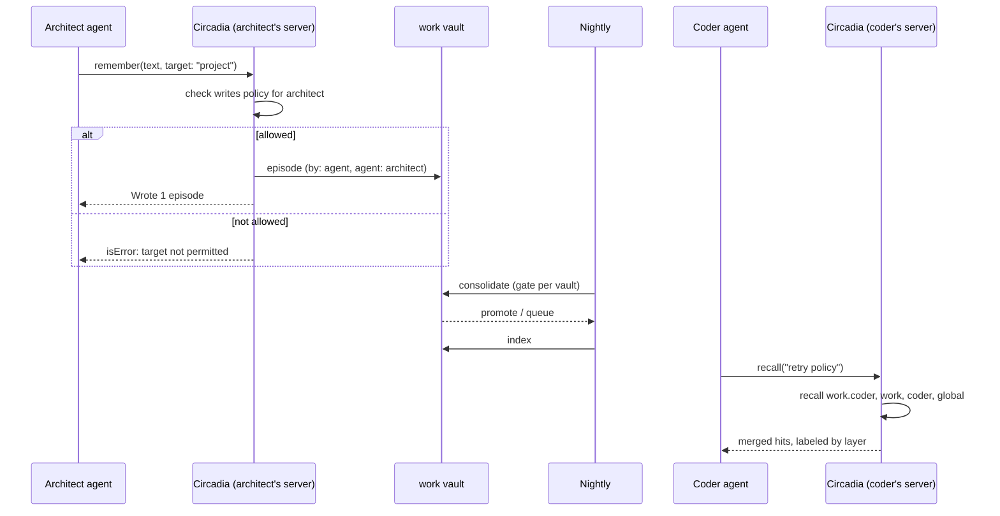

# RFC-0004 discovery: context, workflows, risk

Companion to [RFC-0004: Workspaces](RFC-0004-workspaces.md). It holds the Risk Reduction
Framework deliverables that come before architecture: phase 2 (context and the five
whys), phase 3 (workflows) and phase 4 (risk and rollback).

**RRF tier:** comprehensive (lightweight for phases 9–13). The RFC adds a cross-vault
recall path and an isolation boundary, and its registry, schema and MCP contract are
public and hard to reverse. It entered at phase 5, and phases 2–4 were backfilled here
on 2026-10-02 against `ef39638`.

**Stakeholder:** the operator (one person, many agents). There are no members, Care
Team or clinical pathways; the framework's "member" maps to the operator and the agents
that call the MCP server.

---

## Phase 2: Context and the five whys

### The problem as observed

Issue #3 asks for isolated vaults per agent because agents sharing one vault "pollute
one another". To test that claim before designing around it, I ran the status-quo setup
and measured it. Reproduce with the scripts in
[`scripts/rfc-0004-pollution/`](../../scripts/rfc-0004-pollution/); the output of the
cited run is saved beside them. They live outside `docs/rfcs/` because that folder ships
in the npm package.

**Setup.** Three agents, `architect`, `coder` and `qa`, each run their own
`circadia mcp --vault <shared>` process against **one** vault, the only way to give
several agents memory today. Every write and every agent-facing read goes through the
real MCP server via the official SDK client. The vault holds four human-written
entities (`billing-api` with `uses_db:: [[postgres]]`, plus `postgres`, `redis`,
`sqlite`) and three unrelated older notes. Each agent writes two episodes with
`remember`, in its own session. Consolidation runs the real code path against a
loopback mock model that returns canned candidates keyed by marker words, the pattern
of `test/mock-model-e2e.test.ts`. Predicates: `uses_db` and `retry_max_attempts` are
`single`; `uses_cache` and `known_issue` are `many`.

**What happened.**

| # | Probe | Result |
|---|---|---|
| P1 | Each agent recalls on its own topic (4 probes) | 3–4 of the 5 episode hits in every probe were written by **other** agents. The architect's top hit for "billing api cache and datastore" was the coder's throwaway redis spike, ranked **above** the architect's own decision against redis. |
| P2 | Can anything isolate one agent today? | No. `scope: "tag:coder"` returned **0** hits: `remember` gives episodes no tags and no way to set one. `scope: "episodes/"` returned all three agents. Episode frontmatter records `by: agent` and a `session`, but **not which agent**; after the fact, the vault cannot tell the agents apart. |
| P3 | Does one agent's use change another's memory? | Yes, at the activation level. With 120-day-old episodes (so ACT-R isn't saturated), QA's 15 recalls raised the activation of the **coder's** episode from 0.33 to 0.97, because every QA recall returned and logged it. Rank did not change in this two-episode probe, since both episodes rose together. (A first run with same-day episodes saw no change at all: activation is ~1.0 for anything hours old.) |
| P4 | One nightly consolidation | 4 promoted, 1 queued, 0 superseded. **The coder's throwaway spike became a current project fact**, `uses_cache:: [[redis]]`, which the architect's next recall returned. **The architect's `retry_max_attempts:: 3` and QA's `5` both became current** on a `single` predicate (see B1). QA's `known_issue` was promoted, which is the kind of sharing the project *should* get. The coder's local-dev `uses_db:: [[sqlite]]` was queued as a contradiction, and the queued record carries no hint that it was about a laptop. |
| P5 | Dream sampling (`--sample-only`, no model calls) | Of 13 sampled pairs, 1 paired two different agents' episodes, 9 paired an agent episode with a shared entity, 1 paired one agent's two episodes, and 2 paired shared notes. Cross-agent dream pairs are rare; agent-to-project pairs are the bulk. That matters for design (phase 4, R7). |

**Caveats.**
- The vault is tiny. With 6 episodes and `topK: 8`, most episodes come back for any
  query, so the 3–4-of-5 ratio mostly reflects the base rate (4 of 6 episodes are
  foreign to any one agent). The meaningful signals are ordering (foreign above own) and
  the absence of any mechanism that could exclude foreign content.
- The mock model returns the candidates I chose. A real model may or may not extract
  "spiking a redis cache … throwaway" as `uses_cache`. What the experiment shows is that
  once a candidate is extracted, nothing downstream can see the provisional, role-bound
  context it came from.

### Bugs found along the way (outside RFC-0004's scope)

These are reported here, not fixed (AGENTS.md §10, scope rule). B1 and B2 block parts of
RFC-0004 (phase 4, R3 and R4).

- **B1. Contradictory claims made on the same night both promote on a `single`
  predicate.** `consolidate.ts` reads each subject's current facts from the snapshot
  parsed at the start of the run (`noteById`, line 241). Facts staged earlier in the same
  run are invisible to later candidates. Reproduced in P4. Nothing in that path involves
  agent identity, so one agent writing two episodes in a night triggers it too
  (code-review for the single-agent case). It violates the `cardinality: single`
  contract in CONFIG.md.
- **B2. Consolidation never commits after MCP writes.** `remember` leaves new episodes
  untracked. Consolidation then edits them (`consolidated:`), sees they were dirty before
  the run, and refuses to commit (C8). The warning is printed, and the run's changes are
  left uncommitted. In the normal workflow (agents write by day, consolidation runs at
  night) the "one git commit per run" never happens, so neither does `git revert` of a
  bad night. Reproduced in P4.
- **B3. `remember` does not reindex.** A new episode is invisible to `recall`, including
  the same agent's next call, until something runs `index` or `watch` is running.
  RFC-0003 §2 assumes `remember` reindexes; it doesn't. Confirmed by reading
  `src/mcp/server.ts` and `src/episodes/episode.ts` (no indexer call in either).
- **B4. Long first sentences make `remember` fail.** `slugify()` has no length cap, and
  the episode title is the first sentence, so a 314-character sentence fails with
  `ENAMETOOLONG`. Episode filenames of 216 characters already occur in ordinary use (P1).
  Reproduced.

### Five whys

Each level is marked **observed** (from the experiment or the code) or **inferred**.

**Problem:** agents that share one vault pollute each other's memory.

1. **Why does that matter to the operator?** An agent acts on context that isn't its own.
   The architect retrieved the coder's throwaway spike above its own decision, and after
   one night the spike was a current fact about the project. An agent reading that fact
   would reasonably build on redis. *(observed: P1, P4)*
2. **Why does it happen?** In Circadia the vault is the only unit of memory, and every
   mechanism works vault-wide: recall, consolidation, the schema-fit gate, ACT-R
   activation and dreaming. *(observed: P1, P3, P4, P5; code)*
3. **Why can't agents be kept apart inside one vault?** Nothing records which agent
   wrote what, and the only filter, `scope`, needs tags or paths that agents' writes
   never get. Isolation can't be bolted on afterwards, because the information it would
   need was never stored. *(observed: P2)*
4. **Why does noisy recall become wrong *facts*?** Consolidation treats every
   `by: agent` episode as equally authoritative about every entity. A role-bound or
   provisional statement ("my branch", "local dev", "I suspect") becomes a project-wide
   current fact once its predicate is known. B1 lets two contradicting claims land
   together. *(observed: P4, B1)*
5. **Why does that matter beyond a messy vault?** Circadia's promise is memory you can
   read and trust (ADR-0001; the gate as poisoning defense, ARCHITECTURE §3). Here the
   corruption comes from the operator's own agents, a path the T1 controls don't cover:
   they key on the *kind* of source (`by: user | agent | tool | web`), not on *which
   agent in which context*. *(inferred from the observations plus SECURITY.md T1)*

**Root motivation:** Circadia models where a memory came from by source kind, but has no
notion of the **context** it was formed in. Workspaces make context a first-class,
physical boundary (encoding specificity; ARCHITECTURE grounding in the RFC), and make
moving memory across that boundary an explicit act.

**What the evidence also says.** Not all cross-agent flow is pollution. QA's known issue
reaching the project is the transactive-memory case the shared layer exists for. The
design goal is therefore not "no sharing" but "sharing only by a deliberate route".

### Context to confirm with the operator

The comprehensive tier asks for stakeholder insight and quotes. The only first-hand
statement so far is issue #3. These need your answer before phase 5 is finalized:

1. **Have you seen this in your own vault, or is #3 anticipatory?** The experiment proves
   the mechanism, not its frequency in your use.
2. **How do your agents run today?** Which clients (Zoo Code modes, Mastra agents,
   others)? One vault or several? Do agents run at the same time?
3. **Which sharing do you want by default?** The experiment suggests QA → project
   ("known issues") and architect → project ("decisions") are desired, and
   coder → project is not. Is that right?
4. **How many projects and agents do you expect?** This bounds the lineage-merge latency
   (R13) and how much the setup flow (W1) matters.
5. **Does a "global-agent" layer match how you think of agents?** For example, does
   "the coder" mean one persona across all your projects?

**Restatement check (phase 2 exit).** The framework closes phase 2 when the engineer
restates the problem in their own words. You're the engineer: a sentence or two in your
own words, plus answers to the five questions, closes it.

---

## Phase 3: Workflows

Lanes: **Operator** (you) · **Agent** (an MCP client) · **Circadia** (MCP server, CLI) ·
**Nightly** (scheduled consolidation). The flows assume the RFC as written, in pinned mode.

### W1. Set up a workspace for one project and three agents

| # | Operator | Agent | Circadia | Notes / edge cases |
|---|---|---|---|---|
| 1 | `circadia workspace init ~/memory` | | Writes `circadia.workspace.json`; scaffolds and `git init`s `global/` | Directory exists and isn't empty → refuse (E1) |
| 2 | `workspace add --project work`; then `--project work --agent architect`, `coder`, `qa`; `--agent coder` | | Validates ids, scaffolds each vault, registers it | Bad name → stable problem code (E2) |
| 3 | Sets `writes.agents.architect` and `qa` to `["self","project"]` | | | Policy is a hand edit in v1 (E3) |
| 4 | Adds one MCP server entry per agent: `mcp --workspace ~/memory --project work --agent <role>` | | | Mistyped role → server refuses to start, naming registered agents (E4) |
| 5 | `workspace list` | | Prints cells, each agent's lineage, write policy | The check that the setup is what you meant |
| 6 | | Client connects | `initialize` reports the binding (vault, layers, write targets) in `serverInfo` / instructions | Lets you spot a wrong binding from the client (R8) |

### W2. Shared decision reaches another agent

| # | Operator | Agent | Circadia | Notes / edge cases |
|---|---|---|---|---|
| 1 | | Architect calls `remember({ text, target: "project" })` | Policy check; episode written to `work/episodes/` with `agent: architect` | Target not allowed → `isError`, nothing written (E5) |
| 2 | | Architect's own next recall | Episode not visible until reindex | B3: today nothing reindexes after `remember` (E6) |
| 3 | | | Nightly: `consolidate --workspace` runs each vault in turn | One vault fails → others still run, exit non-zero, per-vault report (E7) |
| 4 | | | `work`'s gate promotes or queues the architect's claim | Same-night contradiction between two writers → B1 (E8) |
| 5 | Reviews `work`'s queue: `review --workspace ~/memory --project work` | | | Queue record shows `agent:` of the source episode (E9) |
| 6 | | Coder recalls | Lineage merge, labeled hits, one budget | A lineage vault's index is missing or stale (E10) |

### W3. Lift a lesson to a broader layer

| # | Operator | Agent | Circadia | Notes / edge cases |
|---|---|---|---|---|
| 1 | Notices a general lesson in `work.coder` | | | |
| 2 | `lift --from work.coder --to coder <note>^<fact>` | | Writes an episode in `coder/` (`by: user`, `source: import`, `origin:`) | Fact id missing, or already superseded → refuse (E11) |
| 3 | | | Next night, `coder`'s gate promotes it; may supersede | Target lacks the subject entity → queues as new entity (E12) |
| 4 | | Coder on **another** project recalls | Hit from the `global-agent` layer | |

### W4. Move an existing vault into a workspace

| # | Operator | Agent | Circadia | Notes / edge cases |
|---|---|---|---|---|
| 1 | `mv my-memory ~/memory/global` | | | Vault's git history moves with it |
| 2 | `workspace adopt global` | | Validates it's a vault; registers `(*,*)` | Already-registered cell → refuse (E13) |
| 3 | Edits MCP entries from `--vault` to `--workspace … --project … --agent …` | | | Old `--vault` entries keep working (E14) |

### Edge cases and dispositions

| # | Edge case | Where | Disposition |
|---|---|---|---|
| E1 | `workspace init` on a non-empty directory | W1.1 | Handled: refuse; `adopt` is the path for existing vaults |
| E2 | Invalid cell name (`../x`, `A`, `a/b`, empty) | W1.2 | Handled: RFC test 1/8 |
| E3 | No CLI for editing write policy | W1.3 | Deferred: hand-edit JSON in v1; `workspace policy` later if it's tedious |
| E4 | Server launched with an unregistered project or agent | W1.4 | Handled: refuse to start; list what is registered |
| E5 | `remember` target not permitted | W2.1 | Handled: `isError`, nothing written; enum hides it |
| E6 | Shared episode invisible until reindex (B3) | W2.2 | **Dependency**: B3 must be fixed, or the docs must say "run `watch` per vault"; see R9 |
| E7 | One vault's consolidation fails (model down, bad config) | W2.3 | Handled: continue other vaults, non-zero exit, per-vault report. Added to RFC §8 |
| E8 | Two writers make contradicting claims the same night | W2.4 | **Blocker**: B1 fix before `target: project` ships (R3) |
| E9 | Reviewer can't tell which agent a queued claim came from | W2.5 | Handled: `agent:` on the episode; `review` prints it. Added to RFC §5 |
| E10 | A lineage vault's index is missing, corrupt or stale | W2.6 | Handled: degrade, recall the rest, report the vault in `byVault.<id>.error`. Added to RFC §4 |
| E11 | Lift of a missing or superseded fact | W3.2 | Handled: refuse, naming the fact's status |
| E12 | Lift whose subject entity doesn't exist in the target | W3.3 | Handled: target's gate queues it as a new entity; operator accepts in `review` |
| E13 | Two vaults claim one cell | W4.2 | Handled: RFC test 1 |
| E14 | Mixed `--vault` and `--workspace` entries pointing at the same vault | W4.3 | Out of scope: allowed; two processes on one vault is today's behavior (R9) |
| E15 | Agent wrote to the wrong vault (bad binding) | any | **Deferred, with risk R8**: episodes are append-only and there is no move tool |
| E16 | Two processes bound to one cell at once (two coder sessions) | W2 | Out of scope: same as two processes on one vault today; RFC-0003's lock addresses it |
| E17 | Agent with no project, `(*, a)` | W1 | Handled: lineage `global-agent`, `global` (RFC §1) |
| E18 | Same entity id in two layers with conflicting facts | W2.6 | Handled: both returned, labeled; precedence orders them (RFC §4.4) |

### Assumptions not yet validated

- Your clients can run one MCP server entry per agent (true for Zoo Code modes and Mastra
  agents, per the project's tooling list; confirm with question 2 above).
- A nightly `consolidate --workspace` replaces one cron entry per vault.
- Agents rarely need to switch project mid-session; switching means a client restart in
  pinned mode.

---

## Phase 4: Risk and rollback

**Door summary:** contains one-way decisions: D1, D3, D7 and D8. Each is flagged for
review below; none is classified two-way to save time.

### Decision inventory

| # | Decision | Door | Why | Extra review? |
|---|---|---|---|---|
| D1 | Flat layout; directory name = vault id | One-way (moderate) | Adopted workspaces on disk would need a migration to change | Yes: confirm before stage 2 |
| D2 | Registry format with a version field | Two-way | Versioned; a migration can convert | No |
| D3 | Physical isolation (one vault per cell), not tags | **One-way** | Memory written into separate vaults can't be merged cleanly (ids collide, `src::` is vault-local), and a shared vault can't be split (episodes append-only). Both choices are hard to undo, which is why the experiment matters | **Yes**: the central decision; the five whys support it |
| D4 | Lineage precedence order | Two-way | Weights and order are config | No |
| D5 | Default write policy `["self"]` | Two-way (policy) / one-way (content) | Changing the default is easy; content written under a looser policy is permanent | No, but document it |
| D6 | Shared writes are episodes through the target's gate | Two-way | Design choice; can add routes later | No |
| D7 | Episode frontmatter `agent`, `origin` | **One-way** | Episodes are append-only; once written, the fields exist forever, and lint must accept them forever | Yes: names and semantics fixed before stage 1 |
| D8 | MCP contract: `layers`, `target`, `vault`/`layer` on hits, qualified hit ids `<vault>:<passageId>` | **One-way (public)** | Shipped in an npm package; clients may parse ids | Yes: keep additive; consider leaving `passageId` unqualified and adding `vault` alongside |
| D9 | One git repo per vault | Two-way | A later `git.ts` fix (`<hash>:./<path>`) would allow one repo | No |
| D10 | Dreaming per vault, no cross-vault pairs | Two-way | Can add later | Yes: costs most dream pairs (R7) |
| D11 | Request-selected mode exists | Two-way | A flag | Accepted risk (A1) |
| D12 | RRF merge with layer weights | Two-way | Config; eval-tuned | No |

### Dependency sweep

| Dependency | Used for | Status |
|---|---|---|
| Consolidation gate (`consolidate.ts`) | Per-vault promotion; shared-layer safety | **B1 must be fixed first** |
| Git commit per run (`vault/git.ts`, C8) | Rollback of a bad night | **B2 must be fixed first** |
| Reindex after write | Freshness of shared memory | B3: fix, or document `watch` per vault |
| `node:sqlite` read-only opens on `:ro` mounts | Container pattern (RFC §8) | Unverified (RFC open question 6) |
| `slugify()` | Episode filenames | B4: independent, but more writers hit it more often |
| RFC-0003 write lock / `busy_timeout` | Several processes writing one shared vault | Not landed; today's behavior applies |
| Extraction model endpoint | Consolidation of every vault | Shared by all vaults via `defaults` |
| MCP SDK (dev only) | Conformance tests | In place (ADR-0008) |

### Risk register

| # | Risk | Likelihood | Blast radius | First detector | Mitigation | Rollback path + speed | Owner |
|---|---|---|---|---|---|---|---|
| R1 | Pinned server leaks a sibling vault's content | Low (siblings are never opened) | Operator; the agent's context for that session | RFC test 3; eval sibling gate (test 13) | Open only lineage vaults; container mounts only the lineage | Revert the release (minutes). Content already in an agent's context can't be recalled | Operator |
| R2 | A provisional or role-bound claim written to a shared layer becomes a shared fact | **Medium–high** once `project` writes are allowed (P4) | Every agent on the project | `review`; a human reading `work/` | Default `self`; per-agent opt-in; `agent:` on episodes; shared writes are deliberate (`target`) | `git revert` of that night's commit (minutes), **but only once B2 is fixed** | Operator |
| R3 | Same-night contradictory claims both promote (B1) | **High** with several writers on a shared layer | Every agent on the project | A lint rule for >1 current fact on a `single` predicate (new) | **Fix B1 before stage 3** | `git revert`, after B2 | Operator |
| R4 | No per-night commit to revert (B2) | **Certain** in today's workflow | Operator's ability to undo | The printed warning | **Fix B2 before stage 3** | n/a: this *is* the rollback path | Operator |
| R5 | Merged recall ranks worse than single-vault recall | Medium | Every bound agent | Eval fixture (stage 7) vs single-vault baseline | `layers` narrowing; tune `layerWeights` | Narrow to one layer (instant); stop using workspaces (`--vault`) | Operator |
| R6 | WAL index can't open on a read-only mount | Unknown | Container users | Container smoke test | Read-only or `immutable=1` opens; else document rw mounts | Mount rw (instant) | Operator |
| R7 | Per-vault dreaming loses agent↔project pairs (9 of 13 in P5) | **Certain** under D10 | Dream quality | Dream-sweep eval | Open question: let a vault's REM pass sample partners from its lineage read-only, writing candidates only to the bound vault | Two-way; revisit after eval | Operator (accept or fund) |
| R8 | Agent bound to the wrong cell writes to the wrong vault | Medium (config typo) | That vault's memory | `workspace list`; binding in `initialize` | Refuse unregistered names; announce binding | Before consolidation: delete the episode files by hand. After: facts carry `src::` to them, so revert the night's commit (needs B2) | Operator |
| R9 | Several processes write and reindex one shared vault concurrently | Medium | One vault's index | `SQLITE_BUSY` errors | `busy_timeout` (RFC-0003 §4, can land first); episodes are separate files, so content writes don't collide | Rebuild the index (`index --full`); it's derived | Operator |
| R10 | Lineage recall latency grows with the number of layers | Low–medium | Bound agents | Benchmark: ~300 ms p50 per 10k-note vault today, up to 4 vaults in sequence → worst case ~1.2 s | Layer vaults are usually small; measure in stage 2 | Narrow `layers` | Operator |
| R11 | Request-selected mode lets one agent reach any cell | Certain when enabled | Whole workspace | n/a | Off by default; named for what it does | Remove the flag (instant) | Accepted (A1) |
| R12 | A schema or MCP field name proves wrong after release (D7, D8) | Low–medium | npm consumers; existing episodes | Review before stage 1 and 3 | Review gates on D7/D8 | Can't remove; deprecate and add | Operator |

### Outage and failure behavior

- **Model endpoint down during `consolidate --workspace`:** each vault fails its
  extraction as today; the loop continues to the next vault; exit non-zero with a
  per-vault report. No vault is half-written: the existing change set applies only on
  success.
- **A lineage vault missing, unreadable, or its index corrupt:** recall degrades. The
  vault is skipped, the result names it in `byVault.<id>.error`, and the rendered text
  says one layer was unavailable. Writes to that vault fail with a tool error. The bound
  cell itself missing → the server refuses to start.
- **Registry invalid:** every `--workspace` command refuses to run, naming the problem.
  Plain `--vault` commands are unaffected.
- **Git missing or a vault not a repo:** as today: consolidation writes without
  committing and warns; `--as-of` falls back to current text and says so.

### Rollback triggers

- **Any sibling content in a pinned recall**, in tests, eval or use → stop the rollout and
  revert. This is the feature's core promise.
- **More than one current fact on a `single` predicate in any vault** → stop enabling
  shared writes until fixed.
- **Eval recall@5 below the single-vault baseline** on the workspace fixture → hold the
  release. The harness is deterministic (ADR-0010), so any drop is real; there is no
  noise band to hide in.

### Accepted risks

| # | Risk | Accepted by | Why acceptable |
|---|---|---|---|
| A1 | R11, request-selected mode exposure | Operator (pending) | One operator by definition; off by default |
| A2 | R7, dream-pair loss | Operator (pending) | Only if the open question is deferred; the cost is certain, so it needs an explicit yes |

### Unknowns

1. Whether pollution happens at a meaningful rate in your real vault (phase 2,
   question 1).
2. Read-only SQLite on `:ro` mounts (R6).
3. Real merged-recall quality (R5); only the eval can answer.
4. Whether a real extraction model turns provisional statements into facts as readily as
   the mock does (P4 caveat).
